# Project Architecture - SDET Playwright Framework

## Codebase Structure Diagram

```mermaid
graph LR
    RESOURCES["📚 resources/"]
    PAGES["📄 pages/"]
    SELECTORS["🎯 selectors/"]
    TESTDATA["📊 test-data/"]
    UTILS["🔧 utils.ts<br/>env.ts"]

    SAUCEDEMO_PAGES["saucedemo/"]
    ORANGEHRM_PAGES["orangehrm/"]
    PAGES_BASE["abstract.page.ts"]

    SAUCEDEMO_SEL["saucedemo/"]
    ORANGEHRM_SEL["orangehrm/"]
    SELECTORS_BASE["abstract.selector.ts"]

    TESTS["🧪 tests/"]
    SAUCEDEMO["saucedemo/"]
    ORANGEHRM["orangehrm/"]

    SD_LOGIN["login.spec.ts<br/>@saucedemo @login"]
    SD_INVENTORY["inventory.spec.ts<br/>@saucedemo @inventory"]
    SD_E2E["full-flow.spec.ts<br/>@saucedemo @e2e"]

    OHR_LOGIN["login.spec.ts<br/>@orangehrm @login"]
    OHR_DASHBOARD["dashboard.spec.ts<br/>@orangehrm @dashboard"]

    RESOURCES --> PAGES
    RESOURCES --> SELECTORS
    RESOURCES --> TESTDATA
    RESOURCES --> UTILS

    PAGES --> SAUCEDEMO_PAGES
    PAGES --> ORANGEHRM_PAGES
    SAUCEDEMO_PAGES -.-> PAGES_BASE
    ORANGEHRM_PAGES -.-> PAGES_BASE

    SELECTORS --> SAUCEDEMO_SEL
    SELECTORS --> ORANGEHRM_SEL
    SAUCEDEMO_SEL -.-> SELECTORS_BASE
    ORANGEHRM_SEL -.-> SELECTORS_BASE

    TESTS --> SAUCEDEMO
    TESTS --> ORANGEHRM

    SAUCEDEMO --> SD_LOGIN
    SAUCEDEMO --> SD_INVENTORY
    SAUCEDEMO --> SD_E2E

    ORANGEHRM --> OHR_LOGIN
    ORANGEHRM --> OHR_DASHBOARD

    %% Styling
    classDef parent fill:#f3e5f5,stroke:#4a148c,stroke-width:2px
    classDef layer fill:#fff3e0,stroke:#e65100,stroke-width:2px
    classDef project fill:#e8f5e9,stroke:#1b5e20,stroke-width:2px
    classDef abstract fill:#ffe0b2,stroke:#e65100,stroke-width:2px
    classDef tests fill:#fce4ec,stroke:#880e4f,stroke-width:2px
    classDef spec fill:#f8bbd0,stroke:#c2185b,stroke-width:2px

    class RESOURCES,TESTS parent
    class PAGES,SELECTORS,TESTDATA,UTILS layer
    class SAUCEDEMO_PAGES,ORANGEHRM_PAGES,SAUCEDEMO_SEL,ORANGEHRM_SEL project
    class PAGES_BASE,SELECTORS_BASE abstract
    class SAUCEDEMO,ORANGEHRM tests
    class SD_LOGIN,SD_INVENTORY,SD_E2E,OHR_LOGIN,OHR_DASHBOARD spec
```

## Folder Structure Explanation

### 1. **Configuration** ⚙️

- **playwright.config.ts** - Test configuration with project matching (@saucedemo, @orangehrm)
- **tsconfig.json** - TypeScript config with path aliases (@/resources, @/tests)
- **package.json** - Dependencies & NPM scripts (test:saucedemo, test:orangehrm, test:login, test:e2e)

### 2. **Resources Folder** 📚

Source code used by tests:

#### **pages/** - Page Object Model

- **abstract.page.ts** - Base page class with `page` and `config`
- **saucedemo/** - SauceDemo page objects (login, inventory, cart, checkout, etc.)
- **orangehrm/** - OrangeHRM page objects (login, dashboard)

#### **selectors/** - UI Locators

- **abstract.selector.ts** - Base class for all selectors
- **saucedemo/** - SauceDemo selectors
- **orangehrm/** - OrangeHRM selectors

#### **test-data/** - Test Fixtures

- **saucedemo/select-item.test-data.ts** - Product selection scenarios

#### **Utilities**

- **utils.ts** - Helper functions (generateRandomNumber, etc.)
- **env.ts** - Environment configuration management

### 3. **Tests Folder** 🧪

Test specifications organized by platform:

#### **saucedemo/** - SauceDemo Platform Tests

- **login.spec.ts** - Login scenarios (@saucedemo @login)
- **inventory.spec.ts** - Sorting & cart operations (@saucedemo @inventory)
- **full-flow.spec.ts** - End-to-end purchase flow (@saucedemo @e2e)

#### **orangehrm/** - OrangeHRM Platform Tests

- **login.spec.ts** - Login scenarios (@orangehrm @login)
- **dashboard.spec.ts** - Dashboard verification (@orangehrm @dashboard)

## Key Features

- ✅ **Three-Layer POM Architecture** - Selectors → Pages → Tests
- ✅ **Project Isolation** - Separate configs for @saucedemo & @orangehrm
- ✅ **Tag-Based Filtering** - Run tests by project or feature (@login, @e2e, etc.)
- ✅ **Reusable Components** - Abstract base classes for code reuse
- ✅ **Type-Safe** - Full TypeScript support with path aliases
- ✅ **CI/CD Ready** - GitHub Actions & GitLab CI integration
